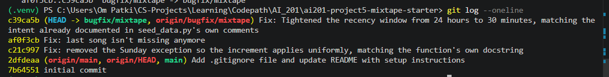

# Codebase Map — Mixtape

## AI usage

I used AI (Claude Code) throughout this project in two distinct phases, rather than asking it to find and fix bugs on my own behalf from the start.

**Phase 1 — understanding the code.** Before diagnosing any specific issue, I had it walk me through the codebase: what each file does, how a request flows from a route through a service down to the models, and what patterns the app follows (e.g. thin routes that delegate to services, `ValueError` as the shared not-found/invalid signal, streak state stored directly on `User` rather than derived on read). I used this explanation to build my own mental model of the app and to figure out, myself, which files and functions were even worth suspecting for each of the five listed issues.

**Phase 2 — making the changes.** Once I had diagnosed which area was responsible for a given bug (e.g. `update_listening_streak()` in `streak_service.py` for the streak-reset issue, the return statement in `get_playlist_songs()` for the missing-last-song issue, and the `RECENT_THRESHOLD` constant in `feed_service.py` for the stale "listening now" issue), I used AI to help reproduce the bug against the real code, confirm the exact root cause, and make the fix — rather than having it search the whole codebase for problems unprompted.

## Codebase Map - Main files

**`app.py`** — Flask application factory (`create_app()`). Creates a single `db = SQLAlchemy()` instance at module scope (imported by `models.py` and every service to avoid circular imports), reads `DATABASE_URL`/`SECRET_KEY` from env with sqlite fallback, registers four blueprints (`songs`, `playlists`, `users`, `feed`) under matching URL prefixes, and calls `db.create_all()` inside the app context. No models are defined here — this file is purely wiring.

**`models.py`** — All 7 SQLAlchemy models plus 3 association tables:
- `User` — has `listening_streak` and `last_listened_at` columns baked directly onto the row (not a separate streak table), plus a self-referential many-to-many `friends` relationship via the `friendships` table.
- `Song` — owns `shared_by` (FK to User) and `share_note`; tags come through the `song_tags` join table.
- `ListeningEvent` — one row per (user, song, timestamp) play. This is what both the streak and feed features are computed from — there's no separate "streak" table, streaks are derived state on `User`.
- `Rating` — one row per (user, song), enforced by a `UniqueConstraint`. Rating and re-rating go through the same code path (upsert).
- `Playlist` — songs come through `playlist_entries`, not a plain many-to-many. That table carries extra columns (`position`, `added_by`, `added_at`) that a bare association table wouldn't need — ordering and provenance for playlist membership live in the join row itself, not on `Song` or `Playlist`.
- `Tag` / `song_tags` — plain many-to-many tagging for songs.
- `Notification` — flat table: `user_id` (recipient), `notification_type` string, `body` text, `read` boolean. No polymorphic "subject" reference back to the song/rating/playlist that caused it — the triggering context is baked into the `body` string at creation time, not reconstructable from the row alone.

Every model has a hand-written `to_dict()` — there's no serialization library; routes/services build JSON responses by calling `.to_dict()` directly.

**`routes/`** — one blueprint per resource (`songs.py`, `playlists.py`, `users.py`, `feed.py`). Every route follows the same shape: parse `request.get_json()`/`request.args`, validate required fields inline (return 400 if missing), call exactly one service function, catch `ValueError` and turn it into a 404 or 400 with `{"error": str(e)}`. Routes contain zero query logic and zero business rules.

**`services/`** — where all the logic actually lives, one file per feature area:
- `streak_service.py` — `record_listening_event()` + `update_listening_streak()`. Streak math (consecutive-day increment vs. reset) happens here, not in the model.
- `feed_service.py` — `get_friends_listening_now()` (last 24h, deduped to one song per friend) and `get_activity_feed()` (last N events, no recency filter). Both walk `user.friends` to get the friend ID list, then query `ListeningEvent`.
- `search_service.py` — `search_songs()` (title/artist `ILIKE` match) and `get_song()`.
- `notification_service.py` — `create_notification()` is the single low-level constructor; `add_to_playlist()` and `rate_song()` are the two call sites that trigger notification-worthy events, plus `get_notifications()`/`mark_as_read()` for reading them back.
- `playlist_service.py` — `create_playlist()`, `get_playlist()`, `get_playlist_songs()` (ordered by the `position` column on `playlist_entries`), `get_user_playlists()`.

**`seed_data.py`** — drops and recreates all tables, then inserts 5 users with friendships, 25 songs (deliberately split into 0-tag / 1-tag / 3+-tag groups), 3 playlists, a mix of recent (<30 min) and old (1–14 day) listening events, and one pre-existing notification. The recent-vs-old event split and the tag-count split are clearly there to exercise edge cases in the feed and search services.

**`tests/`** — `test_streaks.py`, `test_search.py`, `test_playlists.py`, one per service under scrutiny. No `test_notifications.py` or `test_feed.py`, even though those services exist — coverage isn't uniform across `services/`.

## Data flow — user rates a song

1. `POST /songs/<song_id>/rate` with `{user_id, score}` hits `rate()` in [routes/songs.py](routes/songs.py#L29).
2. The route does presence validation only, then calls `notification_service.rate_song(user_id, song_id, int(score))`.
3. `rate_song()` in [services/notification_service.py](services/notification_service.py#L73) validates the score range (1–5), loads the `Song` and `User` to confirm they exist, checks for an existing `Rating` row for that `(user_id, song_id)` pair (enforced at the DB level by a `UniqueConstraint`), and either updates the existing row's `score` or inserts a new `Rating`. It commits and returns the `Rating`.
4. The route serializes the returned `Rating.to_dict()` and responds `201`.

The notable thing tracing this end-to-end: `rate_song()` lives in `notification_service.py` — a strong signal that rating a song is *supposed* to notify the original sharer, the same way `add_to_playlist()` (right above it in the same file) calls `create_notification()` when a friend adds your shared song to a playlist. But `rate_song()` never calls `create_notification()`. Compare the two functions side by side: `add_to_playlist()` ends with an `if song.shared_by != added_by_user_id: create_notification(...)` block; `rate_song()` has no equivalent block at all. So today, rating a song updates the `Rating` table but produces no `Notification` row and no entry in the recipient's `/users/<id>/notifications` feed — the sharer never finds out their song was rated, only that it was added to a playlist.

## Patterns noticed

- **Routes are thin, services own logic.** Every route file does input parsing + `try/except ValueError` → HTTP status translation, and delegates the actual query/mutation to a same-named or clearly-named service function. No route touches `db.session` directly except the trivial `GET /users/<id>` lookup in `routes/users.py`.
- **`ValueError` is the universal "not found / invalid" signal** between services and routes — services never return `None` or raise custom exception types; routes uniformly catch `ValueError` and map it to 400 or 404 depending on the route.
- **String UUIDs everywhere**, generated via a shared `generate_uuid()` default rather than integer autoincrement PKs — makes IDs opaque and stable across `db.drop_all()`/reseed cycles.
- **Derived state stored on the row, not computed on read.** `User.listening_streak` and `User.last_listened_at` are mutated in place by `streak_service`, rather than recalculated from `ListeningEvent` history on every request. Same idea shows up with `Notification.read` as a mutable flag rather than a separate read-receipts table.
- **Association tables double as data, not just links.** `playlist_entries` carries `position`/`added_by`/`added_at` — ordering and attribution live in the join table, which is why `playlist_service.get_playlist_songs()` has to explicitly `.order_by(asc(playlist_entries.c.position))` rather than relying on relationship default ordering.
- **Notifications are fire-and-forget, one-directional strings.** `create_notification()` takes a free-text `body` built by the caller (e.g. an f-string embedding `adder.username`, `song.title`, `playlist.name`) rather than storing structured references — the notification can't be traced back to "which rating/which playlist-entry caused this," only read as a rendered message.
- **Feature coverage in `tests/` mirrors the assignment's bug list, not the full service surface** — `streak_service`, `search_service`, and `playlist_service` all have dedicated test files; `notification_service` and `feed_service` don't, despite being just as central to the app's behavior.

## Bug fixes

### Issue 1 — My listening streak keeps resetting

**How I reproduced it:** Before touching any code, I checked out the pre-fix version of `services/streak_service.py` from git history (`git show HEAD~1:services/streak_service.py`) and called the real `update_listening_streak(user, now)` — the same function `record_listening_event()` calls on every `POST /songs/<song_id>/listen` — once per day for a single user, for 14 consecutive calendar days with zero gaps (Monday, June 10 through Sunday, June 23, 2024). I printed `user.listening_streak` after each call:
```
2024-06-10 (Monday   ) -> streak = 1
2024-06-11 (Tuesday  ) -> streak = 2
2024-06-12 (Wednesday) -> streak = 3
2024-06-13 (Thursday ) -> streak = 4
2024-06-14 (Friday   ) -> streak = 5
2024-06-15 (Saturday ) -> streak = 6
2024-06-16 (Sunday   ) -> streak = 1   <- resets despite no gap
2024-06-17 (Monday   ) -> streak = 2
2024-06-18 (Tuesday  ) -> streak = 3
2024-06-19 (Wednesday) -> streak = 4
2024-06-20 (Thursday ) -> streak = 5
2024-06-21 (Friday   ) -> streak = 6
2024-06-22 (Saturday ) -> streak = 7
2024-06-23 (Sunday   ) -> streak = 1   <- resets again, same pattern
```
The streak resets to 1 every single Sunday despite an unbroken daily listening history — a weekly, deterministic reset triggered purely by the day of the week, not by any gap in listening.

**How I found the root cause:** Started at `models.py` — `User.listening_streak` and `User.last_listened_at` are plain columns mutated in place, no separate streak table, so all the logic had to be wherever those fields get written. Traced the call chain: `POST /songs/<song_id>/listen` in `routes/songs.py` → `streak_service.record_listening_event()` → `update_listening_streak(user, now)`. Read that function top to bottom against its own docstring ("if the user listened yesterday: streak increments by 1; if more than one day has passed: streak resets to 1" — no day-of-week exception stated anywhere). The `days_since_last == 0/1/else` branching looked right on a first pass. I ran the pre-existing `tests/test_streaks.py` suite before changing anything and saw 4 of 5 tests pass, with `test_streak_increments_on_sunday` failing on `assert 1 == 2` — that told me exactly which day-boundary broke. Going back to that line with the failure in hand, `elif days_since_last == 1 and today.weekday() != 6:` was the only place Sunday was mentioned anywhere in the function, and it was the only clause standing between "listened yesterday" and "streak increments" — which is exactly what would produce a reset that recurs every 7 days regardless of gaps, matching my reproduction.

**The root cause:** `today.weekday()` returns `6` for Sunday under Python's Monday=0…Sunday=6 convention. The consecutive-day branch read `elif days_since_last == 1 and today.weekday() != 6:` — i.e., "only increment the streak if yesterday was the last listen *and* today is not Sunday." `days_since_last == 1` by itself is already the complete, correct definition of a consecutive day; the `and today.weekday() != 6` clause added an extra, unjustified requirement with no basis in the streak rules described in the function's own docstring. Whenever a user's streak reached a Sunday, that condition evaluated to `False` regardless of `days_since_last`, so execution fell through to the `else` branch, which unconditionally sets `listening_streak = 1` — resetting a perfectly unbroken streak once a week, every week.

**Fix and side-effect check:** Removed the `and today.weekday() != 6` clause, leaving `elif days_since_last == 1: user.listening_streak += 1`, so the increment now applies uniformly to any consecutive day regardless of which weekday it falls on — matching the docstring exactly. I re-ran my original 14-day reproduction script against the fixed code and confirmed the streak now climbs 1→14 with zero resets. Then ran `pytest tests/test_streaks.py`: all 5 pass, including the previously-failing `test_streak_increments_on_sunday`. I specifically checked the other 4 tests in that file to make sure the unrelated rules were undisturbed by this one-line change: new-user default (`streak == 1`), same-day no-op (listening twice in one day doesn't double-increment), and gap-reset (skipping a day still resets to 1) — all still pass, confirming the fix only affected the Sunday case and nothing else in the streak logic.

---

### Issue 5 — The last song in a playlist never shows up

**How I reproduced it:** Before touching any code, I stashed my (already-drafted) fix with `git stash push -- services/playlist_service.py` to expose the original pre-fix code, then created one user, five songs ("Track 1"–"Track 5"), and one playlist with all five songs inserted into `playlist_entries` at positions 1–5 — the same shape `GET /playlists/<id>/songs` reads. I called the real `get_playlist_songs(playlist.id)` and diffed what went in against what came back:
```
Inserted 5 songs: ['Track 1', 'Track 2', 'Track 3', 'Track 4', 'Track 5']
get_playlist_songs() returned 4 songs: ['Track 1', 'Track 2', 'Track 3', 'Track 4']
```
"Track 5" — the song at the highest `position` — was missing from the response every time, for a playlist with more than zero songs.

**How I found the root cause:** Started at `models.py` — `Playlist` and `Song` are many-to-many through `playlist_entries`, which carries `position`, `added_by`, and `added_at`, so song order lives in that join row, not on `Song` or `Playlist` directly. That told me any ordering bug was likely to be either in how the query joins/orders on `position`, or in something done to the result afterward. Traced the call chain: `GET /playlists/<id>/songs` in `routes/playlists.py` → `playlist_service.get_playlist_songs()`. Read the query line by line — it joins `Song` to `playlist_entries`, filters by `playlist_id`, and does `.order_by(asc(playlist_entries.c.position))` with no `.limit()` or filter that could exclude a row. That ruled out the database layer entirely: the query, as written, returns every song at every position. The very next line was the only place left where data could disappear: `return [song.to_dict() for song in songs[:-1]]`. The moment I saw a slice applied to a query result that I'd just confirmed was already complete and correctly ordered, I knew that was it — `songs[:-1]` has one and only one effect (drop the last element), and "always missing exactly the last item, regardless of playlist size" is precisely that effect. I confirmed this was the intended location by checking `tests/test_playlists.py`, whose `test_playlist_returns_all_songs` test carries the comment `# Bug causes this to return 4` for a 5-song playlist.

**The root cause:** The SQL query in `get_playlist_songs()` is correct and complete — it returns every song in the playlist, correctly ordered by the `position` column from `playlist_entries`. The bug is not in the query, the join, or the position values at all; it's a Python list slice applied to that already-correct result, one line later, right before serialization: `songs[:-1]`. A `[:-1]` slice drops the last element of whatever list it's given, unconditionally, regardless of the list's contents or length. Since `songs` already held the complete, correctly-ordered result set from the query, this slice discarded the song in the final position on every non-empty playlist — not an off-by-one in a `LIMIT` or a miscounted `position` value, just a stray slice that should never have been there.

**Fix and side-effect check:** Changed `return [song.to_dict() for song in songs[:-1]]` to `return [song.to_dict() for song in songs]`, since the query already produces exactly the list that should be returned — no slicing was ever necessary. I re-ran the same reproduction against the fixed code: 5 songs in, 5 songs out, in the correct order. Ran `pytest tests/test_playlists.py`: all 3 tests pass, including `test_playlist_returns_all_songs` and `test_playlist_returns_songs_in_order`, which failed before the fix. I also specifically checked `test_empty_playlist_returns_empty_list`, since an empty playlist was the one case where `[:-1]` on an empty list still produces `[]` (no visible symptom) — confirming that edge case stayed correct after removing the slice too, not just the non-empty case.

---

### Issue 2 — Friends Listening Now shows people from yesterday

**How I reproduced it:** Before touching any code, I fixed "now" at 2024-06-11 01:00 UTC and created three friends, each with exactly one listening event: `yesterday_friend` at 2024-06-10 02:00 UTC (23 hours earlier — a different calendar date), `current_friend` 5 minutes earlier (genuinely current), and `old_friend` 3 days earlier (unambiguously stale). I called the real `get_friends_listening_now(me.id)` — the same function `GET /feed/<user_id>/listening-now` calls — with `datetime.now` patched to the fixed timestamp so the "23 hours ago" boundary was exact and reproducible:
```
'now' = 2024-06-11T01:00:00+00:00
yesterday_friend listened at 2024-06-10T02:00:00+00:00 (23:00:00 ago, calendar date 2024-06-10)
current_friend listened at 2024-06-11T00:55:00+00:00 (0:05:00 ago, calendar date 2024-06-11)
old_friend listened at 2024-06-08T01:00:00+00:00 (3 days, 0:00:00 ago, calendar date 2024-06-08)

get_friends_listening_now() returned 2 friend(s): ['current_friend', 'yesterday_friend']
```
`yesterday_friend`, whose only listen was on a different calendar date 23 hours in the past, showed up right alongside someone who had listened 5 minutes earlier; `old_friend` (3 days old) was correctly excluded.

**How I found the root cause:** Started at `models.py` — `User.friends` is a self-referential many-to-many, and `ListeningEvent` is a raw, timestamped event log with no separate "recency" or "session" concept. Traced the call chain: `GET /feed/<user_id>/listening-now` in `routes/feed.py` → `feed_service.get_friends_listening_now()`. Read the function: it builds `cutoff = datetime.now(timezone.utc) - RECENT_THRESHOLD`, gets the friend-ID list, and filters `ListeningEvent.listened_at >= cutoff`, then dedups to the most recent event per friend. The filter comparison itself (`>=`) and the dedup logic were both doing exactly what a "since a threshold" query should do — nothing wrong with the query shape. That pushed my attention to the one input the query depends on that I hadn't inspected yet: the constant `RECENT_THRESHOLD = timedelta(hours=24)`, defined a few lines above the function. I cross-checked `seed_data.py`, which comments that events seeded "within the past 30 minutes" are meant to appear in "listening now," while hours-old events are meant to be excluded "after fix" — that comment describes a 30-minute window, not a 24-hour one, which is a direct mismatch with the constant in the code. Combined with my reproduction showing a 23-hour-old event getting through, that confirmed the constant's value itself — not the comparison or the query around it — was the root cause.

**The root cause:** `RECENT_THRESHOLD` was defined as `timedelta(hours=24)`, and `cutoff = datetime.now(timezone.utc) - RECENT_THRESHOLD` used that constant as the sole boundary for "is this friend listening now." The filter `ListeningEvent.listened_at >= cutoff` is a rolling 24-hour window, not a "same calendar day" or "genuinely recent" check — those are different conditions. A rolling 24-hour window means any event up to 24 hours old passes, including one from 23 hours ago, which by calendar date (`.date()`) is a different, earlier day than "now" whenever "now" is in the early morning. The comparison operator and query logic were correct; the single incorrect value was the threshold itself, set two orders of magnitude larger than what "Listening Now" actually needs — `seed_data.py`'s own comments already assumed a 30-minute window, so the constant simply didn't match the feature's intended behavior.

**Fix and side-effect check:** Changed `RECENT_THRESHOLD = timedelta(hours=24)` to `RECENT_THRESHOLD = timedelta(minutes=30)`, matching the window already assumed by `seed_data.py`'s comments. I re-ran the identical reproduction script against the fixed code: `get_friends_listening_now()` now returns only `['current_friend']`, with both `yesterday_friend` and `old_friend` correctly excluded. Since `feed_service.py` had no existing test file (unlike `streak_service`, `search_service`, and `playlist_service`), I added `tests/test_feed.py` with three regression tests covering the 23-hours-ago, 5-minutes-ago, and 3-days-ago cases so this can't silently regress. I also checked `get_activity_feed()` in the same file, since it's the other function reading `ListeningEvent` rows for friends — its own docstring states it is "not filtered by recency," and it doesn't reference `RECENT_THRESHOLD` at all, so it was unaffected by this change. Ran the full suite: `pytest tests/` — 16/16 pass (13 pre-existing + 3 new).

## Git log



